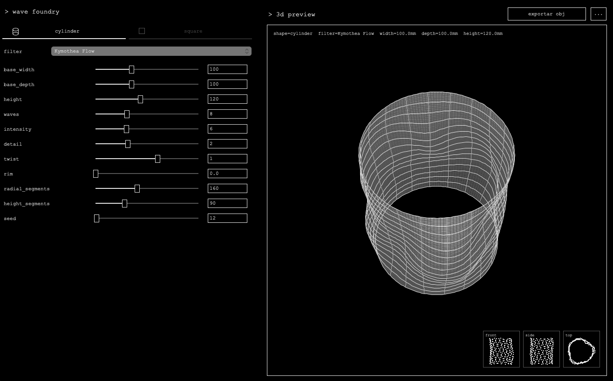

# Wave Foundry

Wave Foundry is a lightweight procedural 3D mesh generator for Blender and 3D printing.

It lets you create organic cylinder and square-based forms, preview them in a simple 3D interface, and export them as `.obj` files.

## Preview



## Features

- Procedural 3D shape generation
- Cylinder and square base shapes
- Editable base width, base depth, and height
- Real-time 3D preview
- Wireframe overlay for reading topology
- Mini front, side, and top previews
- Automatic `.obj` export
- Automatic export file names based on object properties
- Lightweight Tkinter interface
- Optional Perlin noise support through the `noise` package

## Current procedural filters

### Kymothea Flow

The main organic surface filter.

It is designed for:

- soft flowing surfaces
- water-like deformation
- bottle-inspired forms
- long vertical wave structures
- smooth sculptural objects

### Harmonic Flow

A trigonometric procedural wave system.

It is useful for:

- clean abstract waves
- predictable deformation
- stable generative surfaces
- fast previews

### Perlin Flux

A noise-driven surface filter.

It uses real Perlin noise when the optional `noise` Python package is installed.

It is useful for:

- less predictable organic forms
- natural surface variation
- procedural randomness
- experimental mesh generation

## Requirements

- Python 3.10 or newer
- Tkinter
- Optional: `noise` for the Perlin Flux filter

On macOS, Tkinter usually comes with the official Python installer from python.org.

## Installation

Clone the repository:

```bash
git clone https://github.com/YOUR_USERNAME/wave-foundry.git
cd wave-foundry
```

Install optional dependencies:

```bash
pip3 install -r requirements.txt
```

## Run

From the project folder:

```bash
python3 src/wave_foundry.py
```

Or use the helper script:

```bash
./run.sh
```

If the project is on your Desktop:

```bash
cd ~/Desktop/wave-foundry
python3 src/wave_foundry.py
```

## Basic workflow

1. Open Wave Foundry.
2. Choose a base shape: `cylinder` or `square`.
3. Adjust the base dimensions:
   - `base_width`
   - `base_depth`
   - `height`
4. Choose a procedural filter.
5. Adjust the deformation parameters.
6. Rotate the 3D preview by dragging inside the preview window.
7. Export the mesh as `.obj`.
8. Import the result into Blender.

## Importing into Blender

After exporting an `.obj` file from Wave Foundry:

```text
File -> Import -> Wavefront (.obj)
```

Recommended Blender workflow:

1. Import the `.obj`.
2. Check the scale.
3. Apply smoothing if needed.
4. Add material or glass shader.
5. Export to `.stl` if your slicer requires STL.

## 3D printing workflow

Wave Foundry exports `.obj` files with an orientation intended for slicers and 3D workflows.

Recommended workflow:

1. Export `.obj` from Wave Foundry.
2. Open in Blender.
3. Inspect the mesh.
4. Apply final cleanup if needed.
5. Export from Blender as `.stl`.
6. Open the `.stl` in your slicer.

## Controls

### Shape

| Control | Description |
|---|---|
| `cylinder` | Creates a circular or oval base |
| `square` | Creates a square or rectangular base |

### Dimensions

| Control | Description |
|---|---|
| `base_width` | Width of the object base |
| `base_depth` | Depth of the object base |
| `height` | Vertical height of the object |

Set `base_width` and `base_depth` to the same value for a perfect cylinder or square.

### Surface controls

| Control | Description |
|---|---|
| `waves` | Number of procedural wave layers |
| `intensity` | Strength of the deformation |
| `detail` | Frequency/detail of the deformation |
| `twist` | Vertical twist or directional drift |
| `rim` | Irregularity around the top/bottom edge |
| `seed` | Changes the generated form while keeping the same settings |

### Mesh resolution

| Control | Description |
|---|---|
| `radial_segments` | Number of segments around the shape |
| `height_segments` | Number of vertical subdivisions |

Higher values create smoother meshes but may slow down preview and export.

## Project structure

```text
wave-foundry/
├── assets/
│   └── wave-foundry-ui.png
├── src/
│   └── wave_foundry.py
├── README.md
├── requirements.txt
├── .gitignore
├── LICENSE
└── run.sh
```

## Notes

Wave Foundry is currently a small experimental procedural design tool. It is intended for fast visual exploration, mesh generation, and iterative form studies before refinement in Blender.

## License

MIT License.
